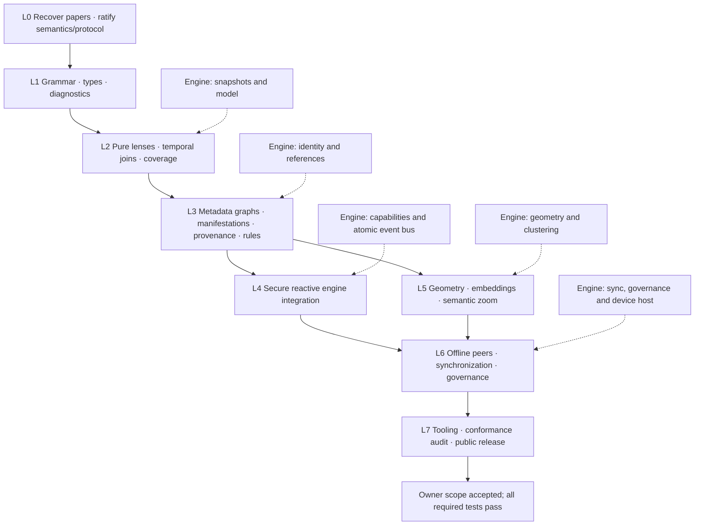
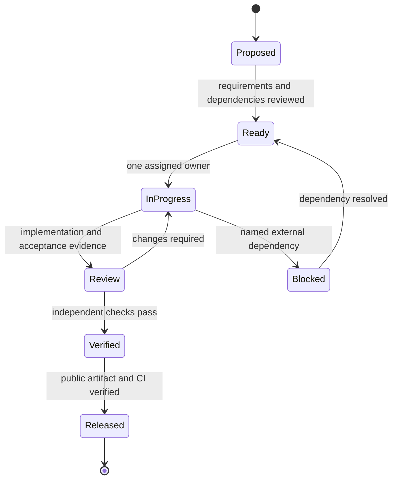

# Implementation workflow

This workflow covers the full [implementation plan](IMPLEMENTATION_PLAN.md). Its executable data representation is [workflow.json](workflow.json). A completed early gate never implies full product completion.

## Work item lifecycle

Each issue names requirement IDs, input/output artifacts, dependencies, one owner and an observable acceptance test. Changes to protocol semantics require review from both project owners and conformance fixtures in both repositories. Work proceeds in isolated branches; implementation, documentation and meaningful tests land together. Never mark `Verified` on a skipped, unsupported or placeholder path.

For each gate, maintain a status entry with commit SHA, exact commands, outcomes, CI/release URLs, known limitations and remaining requirements. Report code implemented, locally verified, integration verified and publicly released separately. Research uncertainty becomes a decision record or blocked item; it does not disappear from the dependency graph.

Security and performance reviews occur while implementing the relevant semantics and again at release. Public issues and documentation use synthetic examples and exclude personal source conversation content that is unrelated to the design.
